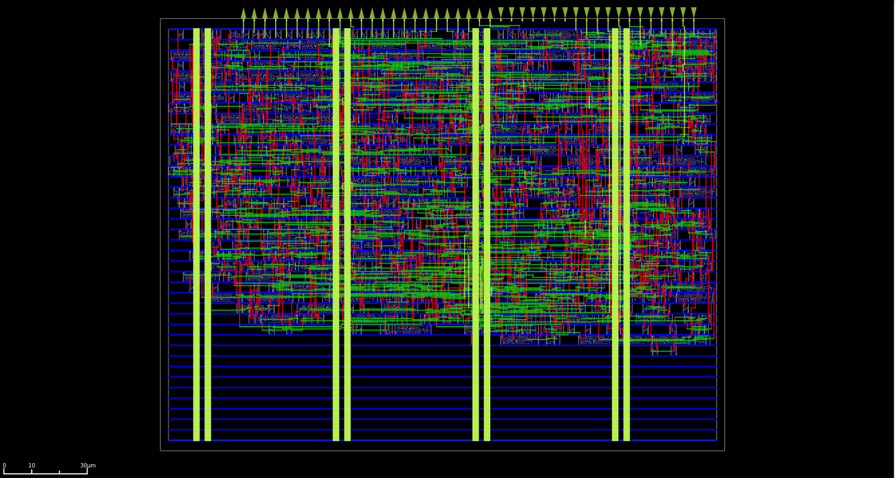
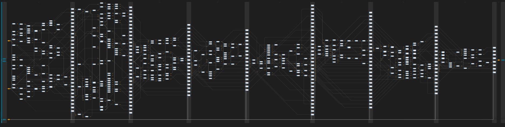

# Uselessly fast bfloat16 multiplier ASIC

This repository contains a very high frequency bfloat16 multiplier ASIC macro taped out as part of the [Tiny Tapeout `iph0p4`](https://tinytapeout.com/) private experimental shuttle,  
targeting IHP's experimental 130 nm CMOS `sg13cmos5l` node.  

This bfloat16 multiplier was designed as part of a maximum frequency challenge and can operate at up to 454.545 MHz on the nominal operating corner of 1.20 V at 25°C.

# Max frequency challenge 

This design was built as a friendly (🔥 w 🔥) competition against [NikLeberg](https://github.com/NikLeberg/tt_um_float_synth/tree/ihp-sg13cmos5l),  
to see which of us could take the crown for the highest possible maximum frequency floating point multiplier on the nominal corner.

Each of us is using a different floating point type for our multiplier:
| Designer       | Module                | Floating Point Type | Denormals | Infinity | NaN | Rounding Mode   |
|----------------|-----------------------|---------------------|-----------|----------|-----|-----------------|
| NikLebery      | `tt_um_float_synth`   | float8             | Yes       | Yes      | No  | RTZ (Round to zero)   |
| Essenceia   | `tt_um_essen`         | bfloat16           | No        | No       | No  | RTZ (Round to zero)  |

## Timing optimization strategy 

Interestingly, each of us chose a very different strategy for optimizing our timing. 

### Synthesizer driven 

Nik chose a tooling focused strategy with a strong emphasis on synthesis optimization, and more specifically backwards looking retiming. (`retime -M 4 -b`)
The main idea of the retiming driven frequency optimization was to introduce extra empty cycle after the logic and let the synthesizer automatically rebalance the logic across these available 
cycles. [The full explaination can be found in the tt_um_float's documentation](https://github.com/NikLeberg/tt_um_float_synth/blob/ihp-sg13cmos5l/docs/info.md).

*Synthesis json results rendered using `LintyServices.linty-graphviz` by NikKeberg, all credit belongs to him.*

By pipelining the floatpoint multiplication over 8 cycles this design managed to reach a maximum operating frequency of `550 MHz`, taking the crown for this challenge.  

### RTL driven 

For the `tt_um_essen` project I chose to optimize timing through the more manual approach of RTL refinement: investing extra effort in optimize the critical paths, and by trading off 
wider logic for shallower paths. This was made much more approachable by the fact I had implemented the `bfloat16` multiplication logic from scratch, as such I had good pre-existing intuitions about which 
logic would be on my critical paths once implemented. 

Unlike the `tt_um_float_synth`, `tt_um_essen` only has an 8-bit long interface, and so needs 4 cycles to shift data in for a multiplication. 
It also needs 2 cycles to stream out the result given the output data bus width is also 8 bits. 
Although I will not be counting these cycles as being part of the floating point multiplication, for full transparency I would like to call to the readers attention that the fact these cycles have less logic depth does help the multiplication's cycles timing.
Additionally, some part of the `tt_um_float_synth`'s first and last path might be consumed by interfacing with the macro's IO pins.

The bfloat16 multiplication was cut into 2 cycles to improve performance. 
As expected, the main critical path went through the mantissa multiplication. 
Unfortunately, in the original implementation of the multiplication, I was using the synthesizer to infer an unsigned Booth radix-4 multiplier.
Thus, in order to help pipeline this path, I needed to re-implement a custom 8-bit unsigned Booth radix-4 multiplier. 

Inside this custom multiplication stage, a flop is added after the encoding stage, in the middle of the compression stage. We are storing the partial compression of the first two partial products, and the last 3 before, on the next cycle compressing them together to get the final result of this mantissa multiplication.

A few additional such implementations were performed throughout the multiplier allowing this design to reach a maximum operating frequency of `454.545` MHz.

## Competition results 

This competition was won hands down by nearly a full 100MHz margin by NikLeber 👑 

| Designer       | Module                | Floating Point Type | Fmul cycles | Fmax | 
|----------------|-----------------------|---------------------|-----------|----------|
| NikLebery      | `tt_um_float_synth`   | float8             | 8      | 550 MHz      |
| Essenceia   | `tt_um_essen`         | bfloat16           | 2        | 454 MHz       | 

## IO bottleneck

Both of us are well aware the the chip's IO is unlikely to reach a stable operating regime above 75MHz on the 
output path and 100MHz on the input path, we nevertheless decided to push our maximum operating frequency as far
as we could. 

# License

This project is licensed under the Apache License 2.0, see the [LICENSE](LICENSE) file for details.

# Credits 

Thanks to the Tiny Tapeout project, IHP, and all the community working on open source silicon tools for making this possible.
